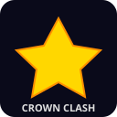

<p align="center">
  
</p>

<h1 align="center">👑 Crown Clash</h1>

<p align="center">
  <b>A chaotic LAN multiplayer maze game — grab the crown, dodge your friends, escape first.</b>
</p>

<p align="center">
  
  
  
  
</p>

---

## 🎮 What is Crown Clash?

Crown Clash is a **local network multiplayer** party game built in Godot 4. Players are dropped into a procedurally generated maze and must race to find the **Crown** — but here's the twist:

- 🏰 The **exit only opens** once a player picks up the crown
- 👑 Other players can **snatch the crown** from the holder
- 🏃 Everyone races to **escape the maze** for points
- 🏆 First player to hit the **point threshold wins the match**

It's tag meets treasure hunt meets maze runner — designed for game nights with friends on the same Wi-Fi.

## ✨ Features

- **Procedural Mazes** — Every round generates a unique maze using recursive backtracker algorithm
- **Server-Authoritative Networking** — Listen-server model with validated RPCs to prevent cheating and desync
- **Synchronized Seed System** — All clients share the exact same maze layout, crown placement, and spawn positions
- **Admin Lobby Controls** — The host gets a full cockpit of settings:
  - Max players (2–10)
  - Maze dimensions
  - Round timer
  - Custom points-per-escape table
  - Victory point threshold
- **Character Selection** — 8 color-coded characters to pick from before each match
- **Crown Mechanics** — Pick up, snatch within range (Spacebar), and escape with the crown for maximum points
- **Scoring System** — Descending point rewards based on escape order (1st gets most, then decreasing)
- **Per-Player Camera** — Each player's viewport follows their own character through the maze

## 🚀 Quick Start

### Requirements
- [Godot 4.3+](https://godotengine.org/download)
- 2+ devices on the same local network (or run multiple instances on one machine)

### Running the Game

1. Clone the repo:
   ```bash
   git clone https://github.com/YOUR_USERNAME/crown-clash.git
   ```
2. Open `project.godot` in Godot 4.3+
3. Press **F5** to run

### Testing Locally

To test multiplayer on a single machine:
1. In Godot: **Debug → Run Multiple Instances → Run 2 Instances**
2. Press **F5** — two game windows will open
3. **Window 1**: Enter a name → **Host New Game**
4. **Window 2**: Enter a name → Keep IP as `127.0.0.1` → **Join**
5. Both windows: Pick a character → Click **Ready**
6. Host clicks **Start Game** — enjoy!

### Playing on LAN

1. Run the game on the host machine → **Host New Game**
2. On other machines, enter the host's local IP address (e.g. `192.168.1.x`) → **Join**
3. Everyone picks characters, readies up, host starts the match

## 🎯 How to Play

| Action | Key |
|--------|-----|
| Move | **W A S D** |
| Snatch Crown | **Spacebar** (must be close to crown holder) |

### Round Flow

```
1. Maze generates → Crown spawns randomly
2. Players explore the maze
3. Someone picks up the Crown → Exit opens
4. Players race to the Exit (or snatch the crown first!)
5. Escape order determines points (1st = 5pts, 2nd = 4pts, ...)
6. First to reach the victory threshold wins the match
```

> 💡 **Tip:** The crown holder moves slightly slower — use that to your advantage when chasing them down!

## 📁 Project Structure

```
crown-clash/
├── project.godot
├── icon.svg
├── scenes/
│   ├── MainMenu.tscn          # Host/Join screen
│   ├── Lobby.tscn              # Pre-game lobby with admin panel
│   ├── Game.tscn               # Main gameplay scene
│   ├── Player.tscn             # Networked player entity
│   ├── Crown.tscn              # Collectible crown item
│   └── Exit.tscn               # Escape portal
└── scripts/
    ├── autoload/
    │   ├── GameConfig.gd       # All game settings (admin-editable)
    │   └── MultiplayerManager.gd  # Authoritative networking layer
    ├── PlayerInfo.gd           # Player data container
    ├── MazeGenerator.gd        # Procedural maze algorithm
    ├── Player.gd               # Movement, snatch, camera
    ├── Crown.gd                # Pickup detection
    ├── Exit.gd                 # Escape detection
    ├── Game.gd                 # Round/match lifecycle
    ├── Lobby.gd                # Lobby UI + admin controls
    └── MainMenu.gd             # Main menu logic
```

## 🛠️ Tech Stack

- **Engine**: Godot 4.3 (GDScript)
- **Networking**: ENet (built-in `ENetMultiplayerPeer`)
- **Architecture**: Listen-server with server-authoritative game logic
- **Maze Generation**: Recursive backtracker with physics-enabled `StaticBody2D` walls

## 🤝 Contributing

Contributions are welcome! Feel free to open issues or submit PRs for:
- New character sprites and animations
- Sound effects and music
- Additional game modes
- UI polish and themes
- Bug fixes

## 📝 License

This project is licensed under the [MIT License](LICENSE).

---

<p align="center">
  Made with ❤️ for chaotic game nights
</p>
